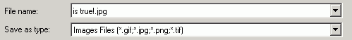



## GDI\+ Type Library

### Description

Example of using GDI+ with VB5/6 This will work on all 32bit OS except Win95. (gdiplus.dll must be installed) This dll is installed with the .net framework or may be installed seperately. Now VB6 uses can save in GIF/JPG/PNG/TIF picture format!

THE CODE IS NOT MINE ~READ ALL REM LINES!~
 
### More Info
 

             |
---                |---
**Submitted On**   |2004-01-26 17:10:44
**By**             |[whoknows](https://github.com/Planet-Source-Code/PSCIndex/blob/master/ByAuthor/whoknows.md)
**Level**          |Advanced
**User Rating**    |4.7 (14 globes from 3 users)
**Compatibility**  |VB 6\.0
**Category**       |[Graphics](https://github.com/Planet-Source-Code/PSCIndex/blob/master/ByCategory/graphics__1-46.md)
**World**          |[Visual Basic](https://github.com/Planet-Source-Code/PSCIndex/blob/master/ByWorld/visual-basic.md)
**Archive File**   |[GDI\+\_Type\_2006627152006\.zip](https://github.com/Planet-Source-Code/whoknows-gdi-type-library__1-65971/archive/master.zip)

